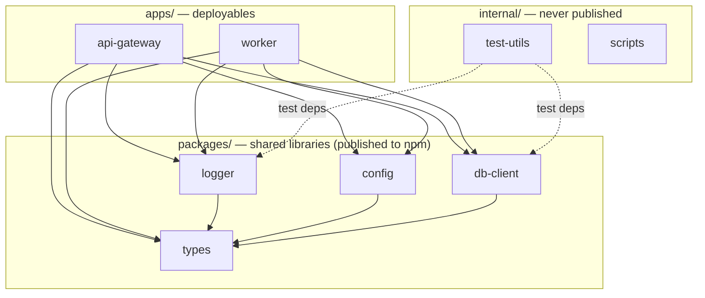

<div align="center">

# ts-monorepo-template

**Production-grade TypeScript microservice monorepo template.**
Nx + pnpm + Vitest + tsdown + Changesets + AGENTS.md — opinionated, agent-friendly, ready for npm + GHCR.

[](https://github.com/shaiknoorullah/ts-monorepo-template/actions/workflows/ci.yml)
[](LICENSE)
[](.nvmrc)
[](https://pnpm.io)
[](https://www.typescriptlang.org)
[](https://renovatebot.com)
[](https://github.com/changesets/changesets)
[](CODE_OF_CONDUCT.md)

</div>

---

## Quick start

```bash
# Bootstrap a new monorepo from this template
gh repo create my-org/my-monorepo --template shaiknoorullah/ts-monorepo-template --public --clone
cd my-monorepo

# Or click "Use this template" on GitHub.

corepack enable
corepack use pnpm@10.15.0
pnpm install
pnpm prepare       # installs lefthook hooks

# From this point on, use the `repo` CLI for everything (see below).
repo doctor        # validates the workspace
repo dev up        # bring up local postgres / redis / kafka
repo test
```

## Developer experience — the `repo` CLI

> Everything a developer does in this repo **except writing business logic** runs through a single CLI: `repo`.

```bash
repo doctor                  # validate local env
repo dev up                  # docker compose up -d (postgres/redis/kafka/...)
repo env render dev          # YAML hierarchy -> docker/.env.rendered
repo new package timing      # scaffold packages/timing/
repo new adr "feature flags" # scaffold docs/adrs/000N-feature-flags.md
repo lint && repo test       # CI mirror — what GH Actions runs
repo deps check              # syncpack + knip + manypkg + attw + publint
```

Every command accepts `--json` and emits a machine-readable `{status, message, data}` payload — useful for agents and scripts. See [`internal/cli/README.md`](./internal/cli/README.md) for the full command reference. The motivating decisions are in [ADR-0007](./docs/adrs/0007-repo-cli-as-dev-interface.md).

### Configuration

YAML, not `.env`. Layered via [c12](https://github.com/unjs/c12) and validated by Zod (see [ADR-0006](./docs/adrs/0006-yaml-config-with-c12.md)).

```
config/
├── schema.ts        # Zod — source of truth
├── base.yaml        # defaults
├── dev.yaml         # extends base
├── staging.yaml
├── prod.yaml
└── tenants/<slug>.yaml
```

`.env` files become rendered artifacts: `repo env render <env>` writes `docker/.env.rendered` for docker-compose consumption. The renderer refuses to emit while any `SecretRef` is still unresolved — secrets must be wired to ESO/Vault/KV before they leave the YAML.

## Table of contents

- [What's in the box](#whats-in-the-box)
- [Architecture](#architecture)
- [Why these choices](#why-these-choices)
- [Recipes](#recipes)
- [Repository structure](#repository-structure)
- [Releasing](#releasing)
- [Agent-friendliness](#agent-friendliness)
- [Contributing](#contributing)
- [License](#license)

---

## What's in the box

| Slot                | Choice                                                                | Why                                                                          |
| ------------------- | --------------------------------------------------------------------- | ---------------------------------------------------------------------------- |
| Package manager     | **pnpm 10.15** (catalogs, workspaces)                                 | Catalog protocol pins versions cluster-wide without per-package duplication. |
| Orchestrator        | **Nx 21** (`nx affected`, remote cache)                               | Best-in-class incremental DAG; PowerPack opens self-hosted caches.           |
| Bundler             | **tsdown** (Rolldown)                                                 | tsup is in maintenance — its README points to tsdown.                        |
| Type emission       | TypeScript project references (`tsc -b`)                              | Composite builds, dependency-aware caching.                                  |
| Test runner         | **Vitest 4** (`test.projects`, v8 + ast-v8-to-istanbul)               | The 2026 TS-first consensus. Istanbul-grade accuracy, V8 speed.              |
| Linter              | ESLint 9 flat + typescript-eslint + sonarjs + unicorn + perfectionist | Deepest TS-aware ruleset. Biome rule depth still lags.                       |
| Formatter           | Prettier 3 + `prettier-plugin-packagejson`                            | Battle-tested. Sorts `package.json` deterministically.                       |
| Dead code           | `knip 6`                                                              | Workspace-aware, fast, supports Nx.                                          |
| Version sync        | `syncpack` + `@manypkg/cli`                                           | Twin defense against dep drift.                                              |
| Type-export check   | `@arethetypeswrong/cli` + `publint`                                   | Catches ESM/CJS/types resolution bugs pre-publish.                           |
| Type coverage       | `type-coverage` (≥ 95%)                                               | Surfaces `any` and `implicit any`.                                           |
| Release             | `@changesets/cli` with **independent** versioning                     | Every package on its own SemVer track. `fixed: []`, `linked: []`.            |
| Preview packages    | `pkg-pr-new`                                                          | Per-PR npm previews (same as Vue/Nuxt/Vite/Svelte).                          |
| Git hooks           | Lefthook                                                              | Go binary, parallel, fast.                                                   |
| Commit lint         | `commitlint` + Conventional Commits                                   | Reliable scope-enum auto-derived from packages.                              |
| Spelling            | cspell                                                                | Catches doc typos in CI.                                                     |
| Security (SAST)     | CodeQL + Semgrep                                                      | Deep + fast. Both upload SARIF.                                              |
| Security (SCA)      | OSV-Scanner                                                           | Google-maintained vulnerability DB.                                          |
| Security (deps)     | Renovate (primary)                                                    | Groups cross-workspace updates. Dependabot can't.                            |
| Security (actions)  | Dependabot                                                            | Narrow scope: GitHub Actions only.                                           |
| Container scan      | Trivy (SHA-pinned)                                                    | Post-Trivy March-2026 incident — `@v4`-tagged actions are out.               |
| SBOM                | CycloneDX                                                             | Standards-track, multi-format.                                               |
| Observability       | OpenTelemetry + pino + `pino-opentelemetry-transport`                 | Worker-thread log shipping; no event-loop pressure.                          |
| Docs                | VitePress + TypeDoc                                                   | Site + API docs, both fast.                                                  |
| Agent compatibility | `AGENTS.md` + `CLAUDE.md` symlink                                     | Universal spec across Claude / Codex / Cursor / Aider / Devin / Copilot.     |

## Architecture



**Invariant**: Dependencies flow one-way. `apps → packages → types`. `packages` may **never** depend on `apps`. `internal` may depend on `packages`. Manypkg + ESLint `import-x/no-cycle` enforce this.

## Why these choices

The full research and rationale is in [docs/architecture/research-summary.md](docs/architecture/research-summary.md). The five most consequential decisions are documented as ADRs:

- [ADR-0001 — tsdown over tsup](docs/adrs/0001-tsdown-over-tsup.md)
- [ADR-0002 — Changesets over release-please](docs/adrs/0002-changesets-over-release-please.md)
- [ADR-0003 — ESLint over Biome](docs/adrs/0003-eslint-over-biome.md)
- [ADR-0004 — Nx over Turborepo](docs/adrs/0004-nx-over-turborepo.md)
- [ADR-0005 — SHA-pinned GitHub Actions](docs/adrs/0005-sha-pinned-github-actions.md)

## Recipes

| Task                       | Command / Link                                                     |
| -------------------------- | ------------------------------------------------------------------ |
| Add a new microservice     | [docs/recipes/add-microservice.md](docs/recipes/add-microservice.md) |
| Add a new shared package   | [docs/recipes/add-package.md](docs/recipes/add-package.md)         |
| Release a new version      | `pnpm changeset` → commit → push (CI does the rest)                |
| Run tests for affected     | `pnpm test:affected`                                               |
| Cut a snapshot/preview     | Open a PR; `pkg-pr-new` posts an install URL as a comment.         |
| Update all deps (managed)  | Renovate opens grouped PRs; merge from the Dependency Dashboard.   |
| Generate API docs          | `pnpm typedoc && pnpm docs:build`                                  |
| Check the workspace health | `pnpm doctor`                                                      |

## Repository structure

```
apps/                  Microservices (Fastify api-gateway, BullMQ worker)
packages/              Shared libraries — logger (pino), config (zod), db-client (drizzle), types
internal/              Private packages: test-utils, scripts, eslint-config, tsconfig
docs/                  VitePress site + ADRs + recipes
docker/                Compose for local dev (postgres, redis, otel-collector)
.changeset/            Pending semver entries
.github/workflows/     12 workflows; all third-party actions SHA-pinned
AGENTS.md              Universal agent spec (also linked as CLAUDE.md)
```

Full directory map and conventions: [AGENTS.md](AGENTS.md).

## Releasing

Independent per-package versioning via Changesets.

```bash
pnpm changeset          # describe the change
git add .changeset/ && git commit -m "chore(release): add changeset"
git push
# CI opens "Version Packages" PR. Merge to publish.
```

Apps in `apps/*` are listed under `ignore` in `.changeset/config.json` because they ship as **containers**, not npm packages. The `docker-build.yml` workflow handles their release.

See [CONTRIBUTING.md § Releasing](CONTRIBUTING.md#releasing) for the full flow.

## Agent-friendliness

This template was designed assuming AI coding agents will work in it. The contract:

1. **`AGENTS.md` at root** — universal spec. Nearest file wins.
2. **`CLAUDE.md`** — symlink to `AGENTS.md` (Claude Code's first-class loader).
3. **Per-package `AGENTS.md`** — each app/package has its own with package-specific rules.
4. **Explicit return types on exports** — every public function. Better DX = better AX.
5. **`// AGENT-TODO(name): <why>`** marker — items reserved for agents.
6. **Recipe folder** — `docs/recipes/*.md` short how-to guides.

Reading order for a new agent: `AGENTS.md` → relevant package's `AGENTS.md` → `docs/recipes/*` → `CONTRIBUTING.md`.

## Contributing

See [CONTRIBUTING.md](CONTRIBUTING.md). All contributors agree to the [Code of Conduct](CODE_OF_CONDUCT.md) (Contributor Covenant 2.1). Report security issues per [SECURITY.md](SECURITY.md).

## License

[MIT](LICENSE) © Shaik Noorullah
