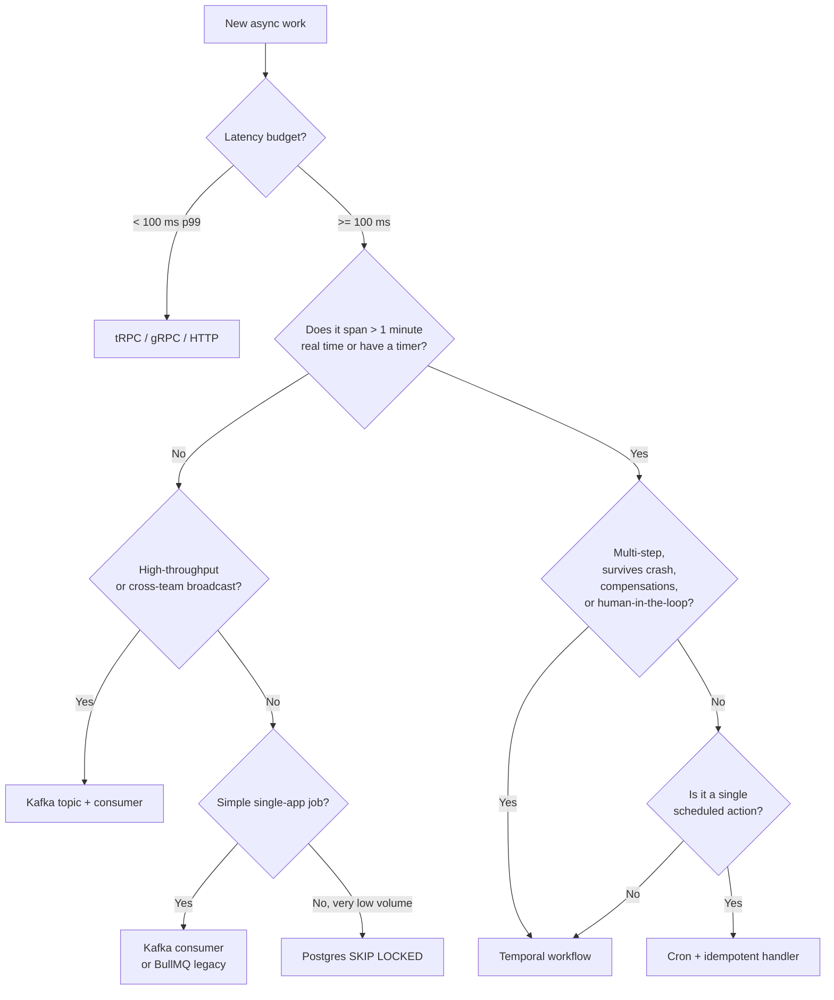

# Temporal — When and When Not

Temporal is a **durable execution platform**. It is not a queue, not an RPC framework, and not an event bus. Using it where one of those is the correct primitive will produce a slow, complex, expensive system. Using it where it fits will turn a 2,000-line saga implementation into 200 lines.

This document is the **decision rule**. If you are about to introduce Temporal for a new use case, your design must map cleanly onto §1. If it does not, choose one of the alternatives in §2.

---

## 1. Use Temporal when

A workload qualifies for Temporal when **all** of these are true, or **any one** of them is non-trivially hard:

1. **The process is multi-step and spans real time** — minutes, hours, days, weeks. Examples: "send onboarding email after 24h", "escalate ticket if unresolved in 72h", "monthly billing run".
2. **It must survive crashes, deploys, restarts** without losing state or re-running already-completed steps.
3. **It has explicit timer requirements** — `sleep(7 days)` semantics that cannot be expressed as a cron without significant glue code.
4. **It calls multiple external systems with retry-and-backoff over hours**, where each call can fail independently and needs its own retry policy.
5. **It needs compensating transactions** (sagas) — "if step 4 fails, undo step 2".
6. **It involves long-running human approvals**, where the workflow waits on a signal from a user (e.g., manager approval) before continuing.
7. **You need deterministic replay for audit**: the ability to reconstruct exactly what the system decided and when, given the same history of external events.

**Canonical examples**:

- Tenant provisioning: create schema → seed defaults → invite admin → wait for first login → activate billing → 7-day "are you stuck?" email if no activity.
- Subscription lifecycle: charge → on failure, dunning sequence over 14 days → retry → cancel with grace period.
- Document approval: submit → notify approvers → wait up to 5 business days → escalate → on approval, fan out to downstream systems → on rejection, return with reason.
- Cross-system migration: per-tenant data move between regions with rollback on partial failure.
- Scheduled batch with per-item retry: nightly invoice generation across 50k tenants with idempotent retry on bank-API flakes.

---

## 2. Do NOT use Temporal when

| Need | Use this instead | Why not Temporal |
|---|---|---|
| Synchronous request/response under 100 ms | tRPC, gRPC, HTTP | Workflow start + activity overhead is ~10–50 ms minimum; you will hate it |
| High-throughput pub/sub between services | **Kafka** (KRaft, see `data-eventing/kafka-single-node-kraft.md`) | Temporal is not designed for >10k events/s/queue; Kafka is built for it |
| Cross-team event-driven integration with replay | Kafka + schema registry | Kafka is the lingua franca; Temporal workflows are an implementation detail of one team |
| Simple background jobs, single app, short-lived | **Kafka consumer** or, for legacy, BullMQ | Adding Temporal infra for "send a welcome email" is over-engineering |
| Very low volume, simple "table as queue" | Postgres `SKIP LOCKED` (`brandur.org/job-drain`) | If you can fit it in a 50-line cron, do that |

Anti-patterns we have observed in the wild and forbid here:

- **"We used Temporal for a 500 ms request handler so we'd have retries."** Wrong. Use a retry wrapper in the caller and a deadline. Temporal adds two network hops and a history write.
- **"We made each REST endpoint a workflow."** Wrong. Endpoints are stateless RPC. Workflows are stateful processes.
- **"We replaced Kafka with Temporal signals to broadcast events."** Wrong. Signals are 1-to-1 to a known workflow ID; they are not pub/sub.
- **"We did `fetch()` inside the workflow function so it would be retried."** Wrong. Network calls go in **activities**, never workflows. See §4.

---

## 3. Decision tree



The tree is **conservative**: when in doubt between Temporal and a simpler primitive, **start simpler**. Migrating a cron to a workflow later is cheap. Migrating a sprawling workflow back to cron is expensive.

---

## 4. Determinism — the rule that makes Temporal Temporal

Workflow code is **replayed from history** on every worker restart, deploy, or migration. To produce the same result, it must be deterministic:

- **No** `Math.random()`, `Date.now()`, `crypto.randomUUID()` directly in workflow code. Use `workflow.uuid4()`, `workflow.now()`.
- **No** direct I/O: no `fetch`, no DB calls, no `fs`. Wrap them in activities.
- **No** non-deterministic iteration (e.g., `for (const k of Object.keys(map))` is fine because property order is defined in modern JS, but iterating over a `Set` populated from a network response is not — the response goes in an activity).
- **No** `setTimeout` / `setInterval` — use `workflow.sleep()` or timers.
- **No** importing modules with side effects that change between runs.

```ts
// BAD — non-deterministic
import { defineWorkflow } from '@temporalio/workflow'
export async function badOnboarding(userId: string) {
  const id = crypto.randomUUID()           // ← non-deterministic
  const start = Date.now()                  // ← non-deterministic
  const res = await fetch(`/users/${userId}`) // ← I/O in workflow
  // …
}

// GOOD
import * as workflow from '@temporalio/workflow'
import type * as activities from './activities'

const { fetchUser, sendEmail } = workflow.proxyActivities<typeof activities>({
  startToCloseTimeout: '30s',
  retry: { initialInterval: '1s', maximumAttempts: 5 },
})

export async function onboarding(userId: string): Promise<void> {
  const traceId = workflow.uuid4()
  const start = workflow.now()
  const user = await fetchUser(userId)
  await workflow.sleep('24h')
  await sendEmail({ to: user.email, traceId, kind: 'day1-check-in' })
}
```

---

## 5. Versioning — `patched` and `getVersion`

You will eventually change a workflow. If a workflow instance started under v1 is still running when you deploy v2, replay must produce v1's behavior, not v2's, or the workflow will fail with `NonDeterminismError`.

Use the **`patched`** API (preferred in modern SDKs) or `getVersion` for older flows:

```ts
import * as workflow from '@temporalio/workflow'

export async function billingRun(tenantId: string): Promise<void> {
  await chargeCard(tenantId)
  if (workflow.patched('send-receipt-v2')) {
    // new behavior — only for workflows that did NOT already replay the old branch
    await sendReceiptV2(tenantId)
  } else {
    await sendReceiptV1(tenantId)
  }
}
```

Rules:

- **Never** rename, reorder, or remove activities called in a still-running workflow without `patched` / `getVersion`.
- **Never** change the signature of a signal/query handler in a still-running workflow.
- When all v1 workflows have completed (check via `WorkflowService.ListWorkflowExecutions`), you may `deprecatePatch('send-receipt-v2')` and later remove the gate.
- For sweeping rewrites: start a **new task queue** and a new workflow type; let the old one drain.

See: [docs.temporal.io/dev-guide/typescript/versioning](https://docs.temporal.io/dev-guide/typescript/versioning).

---

## 6. Worker process anatomy

A **worker** is a stateless Node process that polls one or more task queues and executes workflow and activity code. Conventions:

- **One worker process per task queue per service** (e.g., `billing-tq`, `onboarding-tq`). Do not multiplex unrelated queues onto one worker — you lose isolation under load.
- Workers are **stateless** and **restart-safe**. Killing -9 a worker mid-activity is fine; Temporal redrives.
- Run workers as a `Deployment` (replicas ≥ 2) — not a `StatefulSet`. No PVCs.
- **Activities** may hold connections (DB pools, HTTP clients) initialized at worker startup. Workflows must not.
- Resource sizing: workflow workers are CPU-bound (replay); activity workers are I/O-bound. Split them when one workflow becomes a hot path (`workflow-worker` vs `activity-worker` Deployments sharing a task queue).
- **Graceful shutdown**: SIGTERM → stop polling → drain in-flight activities up to `shutdownGraceTime` → exit. Configure your container `terminationGracePeriodSeconds` to be at least that long.
- **Heartbeats**: long-running activities (>30s) must `heartbeat()` and accept cancellation. Without heartbeat, the activity will be re-dispatched on worker death only after the full `startToCloseTimeout` — wasted time.

---

## 7. Test patterns

Three test layers:

1. **Unit-test activities** like normal TS functions. They are normal TS functions.
2. **Unit-test workflow logic** with `@temporalio/testing`'s `TestWorkflowEnvironment` and time-skipping:

```ts
import { TestWorkflowEnvironment } from '@temporalio/testing'
import { Worker } from '@temporalio/worker'
import { onboarding } from './workflows'

test('onboarding sends day1 email after 24h', async () => {
  const env = await TestWorkflowEnvironment.createTimeSkipping()
  try {
    const worker = await Worker.create({
      connection: env.nativeConnection,
      taskQueue: 'test',
      workflowsPath: require.resolve('./workflows'),
      activities: { fetchUser: async () => ({ email: 'a@b.com' }), sendEmail: vi.fn() },
    })
    const handle = await env.client.workflow.start(onboarding, {
      args: ['u1'], taskQueue: 'test', workflowId: 'wf-1',
    })
    await worker.runUntil(handle.result())
    // time-skipping fast-forwards through workflow.sleep('24h')
  } finally {
    await env.teardown()
  }
})
```

3. **Replay tests** to catch non-determinism regressions. Export workflow histories from staging, replay them against the new code in CI:

```ts
import { Worker } from '@temporalio/worker'
import { readHistory } from './fixtures'

test('replay 2026-Q1 histories without NonDeterminismError', async () => {
  const history = await readHistory('fixtures/onboarding-2026q1.json')
  await Worker.runReplayHistory(
    { workflowsPath: require.resolve('./workflows') },
    history,
  )
})
```

Replay tests are **mandatory** in CI for any workflow that has been deployed to prod at least once. They are the only way to catch breaking changes before they reach a running workflow.

---

## 8. Operational rules

- **One Temporal namespace per environment** (`dev`, `staging`, `prod`). Never share.
- **Task queue names** follow `<bounded-context>-tq` (see `repo-governance.md`).
- **Workflow IDs** must be deterministic and idempotent: `onboarding/<tenantId>/<userId>`. Use `WorkflowIdReusePolicy: REJECT_DUPLICATE` to make double-starts loud.
- **Activity timeouts** are mandatory. There is no "default — wait forever" in this repo.
- **Retention**: set `retention` per namespace; default 30 days. Long-retention is a forensic feature, not a backup.
- **Search attributes** (custom): always set `tenantId`, `bcId` (bounded context), `releaseSha`. They make incident triage tractable.

---

## 9. References

- Determinism rules: <https://docs.temporal.io/encyclopedia/workflows#determinism>
- TS SDK versioning: <https://docs.temporal.io/dev-guide/typescript/versioning>
- Testing: <https://docs.temporal.io/dev-guide/typescript/testing>
- Workers: <https://docs.temporal.io/workers>
- "Use a Postgres queue" baseline: <https://brandur.org/job-drain>
- Kafka design (why it is not Temporal): <https://kafka.apache.org/documentation/#design>
- tRPC (why it is not Temporal): <https://trpc.io/docs/server/introduction>
